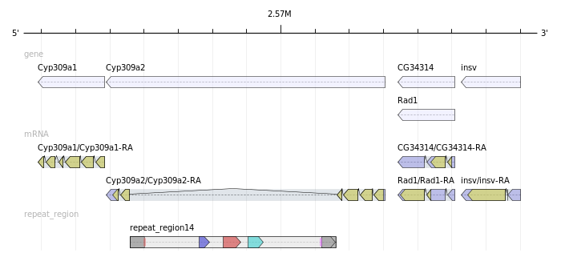

# singularity-genometools
[](https://cloud.sylabs.io/library/icaoberg/default/genometools)

[](https://travis-ci.org/icaoberg/singularity-genometools)
[](https://github.com/icaoberg/singularity-genometools/issues)
[](https://github.com/icaoberg/singularity-genometools/network)
[](https://github.com/icaoberg/singularity-genometools/stargazers)
[](https://www.gnu.org/licenses/quick-guide-gplv3.en.html)



The GenomeTools genome analysis system is a [free](http://genometools.org/license.html) collection of bioinformatics [tools](http://genometools.org/tools.html) (in the realm of genome informatics) combined into a single binary named gt. It is based on a C library named “libgenometools” which consists of several modules.

## Pre-requisites

* [Singularity v3.5.+](https://sylabs.io/docs/).

## Building the image using the recipe

### To build the image locally
Run the script `build.sh` to build image locally.

```
bash ./build.sh
```

### To build the image remotely remotely
Run the script `rbuild.sh` to build image remotely.

```
bash ./rbuild.sh
```

You will need to edit the script above to match your account on [SyLabs.io](https://sylabs.io/).

### Pulling from the repository
If you have the client installed and cannot build the image locally nor remotely, simply run

```
singularity pull library://icaoberg/default/genometools:v1.6.0
```

## Disclaimer

I am nothing but a humble programmer creating the container for this wonderful app. The GenomeTools are being developed by Gordon Gremme, Sascha Steinbiss, Stefan Kurtz and [others](https://github.com/genometools/genometools/blob/master/CONTRIBUTORS).

---
[](http://www.cbd.cmu.edu)

Copyleft © 2019-2020 [icaoberg](http://www.andrew.cmu.edu/~icaoberg) at the [Computational Biology Department](http://www.cbd.cmu.edu) in [Carnegie Mellon University](http://www.cmu.edu)
